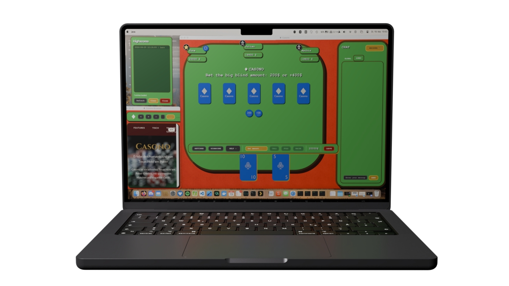
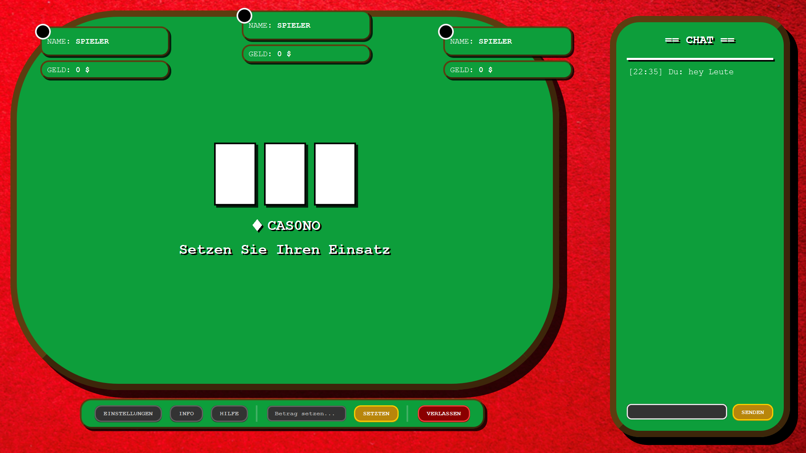

> [!IMPORTANT]
> ## Programming Project (CS108)
> 
> - **Course:** Programmierprojekt (CS108)
> - **Semester:** FS26
> - **Institution:** University of Basel
> - **Duration:** 18 February 2026 – 29 June 2026
> - **Project Type:** Group Project
> - **Project members:** Mathis Ginkel, Lars Winzer, Jona Walpert and me (Julian Kropff)
> 
> ### Topic
> 
> As part of the *Programming Project* course (CS108) for the semester FS26 at the University of Basel, we developed a computer game implementation of the popular card game Poker.
> 
> The project's focus was networking and distributed systems design. A key aspect of the implementation was the development and integration of a custom protocol specifically designed for client-server communication. This protocol handled game state synchronization, player actions, lobby and global chat functionality, and real-time updates across the network.
> 
> ### Contribution Context
> 
> This repository contains work created during the official duration of the course in collaboration with three other students.
> 
> Further information regarding individual contributions, repository state, synchronization status, and project ownership may be documented separately within this repository.

<div align="center">

</div>

<br/>

<div align="center">
<h2>Syntax Syndicate</h2>
<p>Jona • Mathis • Julian • Lars</p>
</div>

## Table of Contents

- [About the Project](#about-the-project)
- [Repository Structure](#repository-structure)
- [Prerequisites](#prerequisites)
- [Development Timeline](#development-timeline)


## About the Project

<div align="center">

</div>

As part of the Programming Project course (CS108) for the semester FS26 at the University of Basel, we are developing a computer game implementation of the popular card game **Poker**.

The project's focus lies in **networking** and distributed systems design.
Key aspect of our implementation being the development and integration of a **custom protocol** specifically designed for **client-server communication**.
This protocol handles game state synchronization, player actions, lobby and global chat, and real-time updates across the network.


## Repository Structure

```
├── src/                     # Source code directory
│   ├── main/                # Application code
│   └── test/                # Unit tests
├── documents/               # Project resources and documentation
│   ├── images/              # Images for README and documentation
│   ├── diary                # Diary files for each organizational meetup
│   ├── docs                 # Documentation
│   ├── milestones/          # Milestone deliverables (6 milestones)
│   └── (Other resources)    # Additional project materials
└── outreach/                # Public-facing content and marketing materials
```


## Prerequisites
- Java Development Kit (JDK) 25
- Gradle (included via Gradle Wrapper)


## Development Timeline

This project spans six milestones throughout the FS26 semester, with each milestone representing a major phase in development:

### **[MS-1](https://p9.dmi.unibas.ch/cs108/2026/#Milestone%201): Foundation & Design**
- Game concept and rules presentation
- Networking architecture overview
- Project mockups and requirements analysis
- Detailed project plan and team organization

### **[MS-2](https://p9.dmi.unibas.ch/cs108/2026/#Milestone%202): Networking & Server Implementation**
- Human-readable custom protocol definition and implementation
- Server implementation with multi-client support
- Client-server chat functionality
- Protocol documentation and validation
- JavaDoc code documentation and QA concepts

### **[MS-3](https://p9.dmi.unibas.ch/cs108/2026/#Milestone%203): Knowledge Checkpoints**
- Assessment of individual technical understanding through evaluation

### **[MS-4](https://p9.dmi.unibas.ch/cs108/2026/#Milestone%204): Game Logic & Working Prototype**
- Core game logic implementation
- Playable game demo (terminal or GUI)
- Command-line argument parsing
- Multiple lobby support with internal chats
- Whisper/private messaging functionality
- Build automation and executable JAR

### **[MS-5](https://p9.dmi.unibas.ch/cs108/2026/#Milestone%205): Polish & Complete User Interface**
- Full GUI implementation with JavaFX
- Complete game playability through UI
- Persistent high score list
- Comprehensive unit tests
- Game rule enforcement

### **[MS-6](https://p9.dmi.unibas.ch/cs108/2026/#Milestone%206): Final Delivery & Public Presentation**
- *Bug-free* final demo
- Complete GUI with all functionality
- Outreach materials and project documentation
- Game manual and usage instructions
- Team logo and promotional materials
- QA reports and lessons learned
