# Casono Rules Easy Description
<!-- vim-markdown-toc GFM -->

* [Deustch](#deustch)
    * [Blinds (Small Blind & Big Blind)](#blinds-small-blind--big-blind)
    * [Erste Setzrunde (Preflop)](#erste-setzrunde-preflop)
    * [Beispiel Preflop](#beispiel-preflop)
    * [Flop (3 Gemeinschaftskarten)](#flop-3-gemeinschaftskarten)
    * [Beispiel Flop](#beispiel-flop)
    * [Turn (4. Karte)](#turn-4-karte)
    * [River (5. Karte)](#river-5-karte)
    * [Showdown (Gewinnentscheidung)](#showdown-gewinnentscheidung)
    * [Poker Hand Rankings (Gewichtung)](#poker-hand-rankings-gewichtung)
    * [Fazit](#fazit)
* [English](#english)
    * [Blinds (Small Blind & Big Blind)](#blinds-small-blind--big-blind-1)
    * [First Betting Round (Preflop)](#first-betting-round-preflop)
    * [Preflop Example](#preflop-example)
    * [Flop (3 Community Cards)](#flop-3-community-cards)
    * [Flop Example](#flop-example)
    * [Turn (4th Card)](#turn-4th-card)
    * [River (5th Card)](#river-5th-card)
    * [Showdown (Winning Decision)](#showdown-winning-decision)
    * [Poker Hand Rankings (Hierarchy)](#poker-hand-rankings-hierarchy)
    * [Conclusion](#conclusion)

<!-- vim-markdown-toc -->

## Deustch

Der Pokertisch ist ein unglaublich faszinierender Erlebnisraum, in dem man sehr viel lernen kann: über sich selbst, über andere Menschen und über Fragen wie: wie treffe ich eigentlich Entscheidungen, wie gehe ich mit Stress und Unsicherheit um, und wie gut bin ich überhaupt darin, mich in andere hineinzuversetzen und Situationen richtig einzuschätzen.

Damit du in diesen Erlebnisraum starten kannst, ist es – wie bei jedem Spiel – notwendig, zuerst die Grundregeln und den Spielablauf zu verstehen.

Also los geht es:

Wir haben am Tisch **4 Spieler**: Julian, Mathis, Jona und Lars. Jeder Spieler startet mit **20.000 Chips**. Jeder bekommt **2 Karten auf die Hand**, und es gibt zusätzlich **5 Gemeinschaftskarten**, die später in der Mitte aufgedeckt werden.

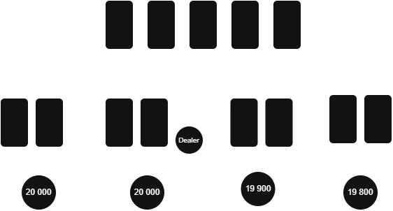

Die Spieler sitzen so: Julian, Mathis, Jona und Lars. Einer davon hat den Dealer-Button, der bestimmt, wer die Karten austeilt und von wo die Runde beginnt. Dieser Button wandert nach jeder Runde im Uhrzeigersinn weiter und verändert damit die Positionen ständig.

Regel: *34 Button Placement and Movement 🟢*

---

### Blinds (Small Blind & Big Blind)

Bevor die Karten verteilt werden, gibt es zwei Pflicht-Einsätze:

Der Small Blind und der Big Blind. Der Big Blind ist immer doppelt so hoch wie der Small Blind.

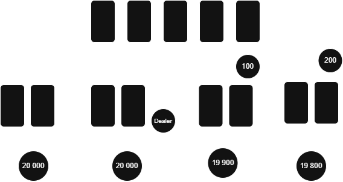

Regel: *32 Dead Button 🟡*

Diese Einsätze sorgen dafür, dass sofort ein Pot entsteht und das Spiel überhaupt beginnt, weil jeder schon “im Spiel” ist.

Danach werden die Karten verteilt: zuerst Small Blind, dann Big Blind und dann im Uhrzeigersinn alle anderen Spieler.

---

### Erste Setzrunde (Preflop)

Die erste Setzrunde beginnt immer bei dem Spieler links vom Big Blind.

Jetzt muss jeder Spieler entscheiden:

* Fold (aussteigen)
* Call (mitgehen)
* Raise (erhöhen)

Regel: *40 Methods of Betting 🟢*
Regel: *41 Methods of Calling 🟢*
Regel: *42 Methods of Raising 🟢*
Regel: *50 Acting in Turn 🟢*

---

### Beispiel Preflop

Julian schaut seine Karten und entscheidet sich direkt für einen Call von **600 Chips**.

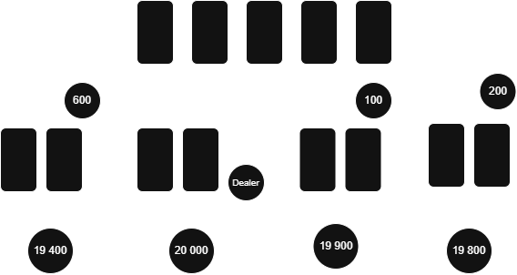

Mathis sieht seine Karten und merkt, dass sie nicht gut sind, also foldet er und steigt aus.

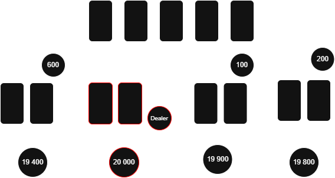

Jona ist nun dran und entscheidet sich ebenfalls für einen Call, weil seine Hand spielbar ist.

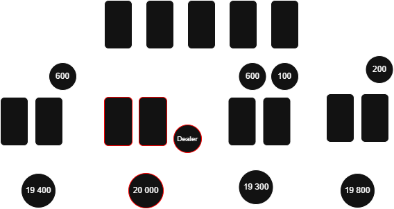

Lars schaut seine Karten an, erkennt eine starke Hand und erhöht auf **1200 Chips**.

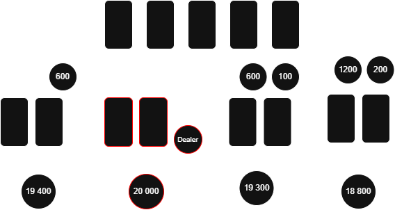

Damit verändert sich sofort die Situation: Julian und Jona müssen entscheiden, ob sie diesen Raise bezahlen, selbst erhöhen oder aussteigen.

---

### Flop (3 Gemeinschaftskarten)

Jetzt werden **3 Gemeinschaftskarten** in die Mitte gelegt. Ab hier verändert sich das Spiel komplett, weil alle Spieler zusätzliche Informationen bekommen.

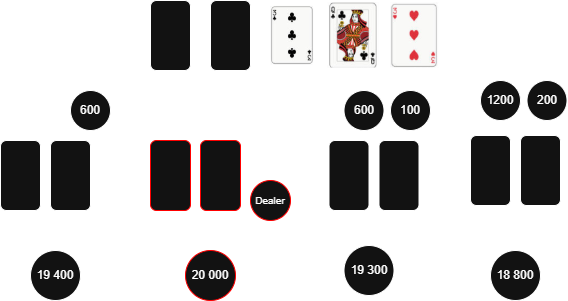

Es beginnt eine neue Setzrunde.

Regel: *49 Accepted Action 🟢*

---

### Beispiel Flop

Lars setzt **1000 Chips** als erstes. Julian entscheidet sich, mitzugehen (Call), weil seine Karten durch die Gemeinschaftskarten stärker geworden sind.

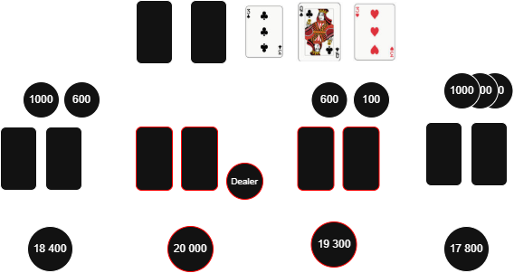

Jona steigt aus, weil er keine gute Verbindung mehr sieht. Mathis ist bereits raus.

---

### Turn (4. Karte)

Jetzt kommt die **4. Gemeinschaftskarte**.

Wieder beginnt eine neue Setzrunde.

Lars setzt diesmal **3000 Chips**. Julian bezahlt erneut (Call), weil seine Hand weiterhin gut spielbar ist.

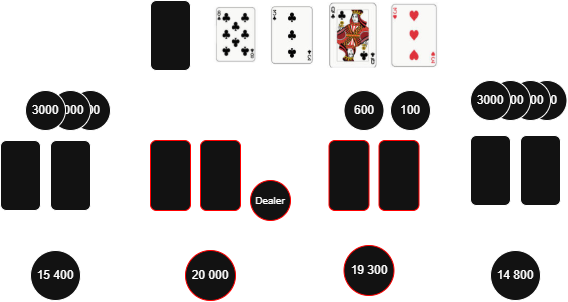

Regel: *53 Action Out of Turn 🟡*

---

### River (5. Karte)

Jetzt wird die letzte Gemeinschaftskarte aufgedeckt.

Dies ist die letzte Entscheidung im Spiel.

Lars setzt **5000 Chips**.

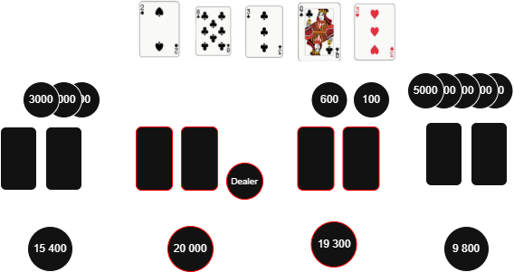

Julian muss jetzt entscheiden: Fold, Call oder sogar Raise auf **10000 Chips**.

Regel: *54 Pot Size Bets 🟡*

---

### Showdown (Gewinnentscheidung)

Wenn nach der letzten Setzrunde noch zwei Spieler übrig sind, kommt es zum Showdown.

Beide Spieler zeigen ihre Karten offen. Gewonnen hat die **beste 5-Karten-Kombination aus Handkarten und Gemeinschaftskarten**.

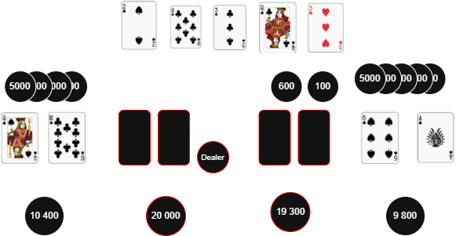

Regel: *12 Cards Speak at Showdown 🟢*
Regel: *16 Face Up for All-Ins 🟢*
Regel: *17 Non All-In Showdowns 🟢*

Wenn Julian den letzten Einsatz bezahlt, werden die Hände verglichen. Wenn er foldet, gewinnt Lars automatisch den gesamten Pot.

---

### Poker Hand Rankings (Gewichtung)

Die Kartenkombinationen sind klar geordnet – von schwach bis extrem stark:

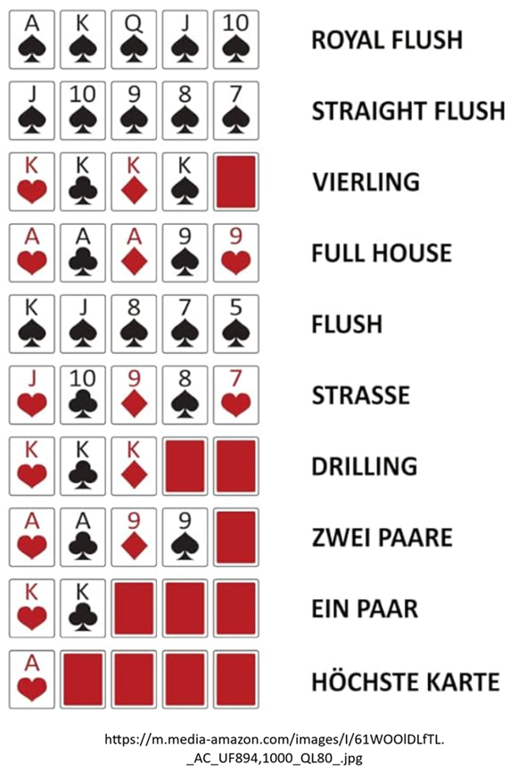

Je höher die Kombination, desto stärker die Hand und desto wahrscheinlicher der Gewinn.

Julian: 2. Pare: 

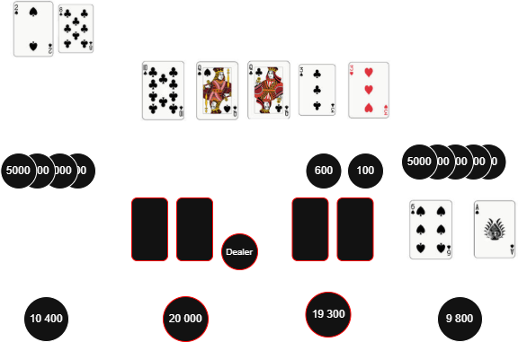

Lars: 1. Par:

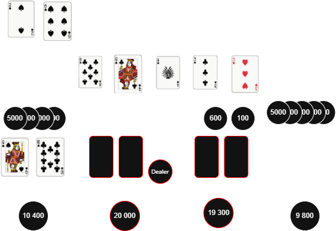

Da zwei Paare in der Rangfolge über einem einzelnen Paar stehen, gewinnt Julian diese Runde.

---

### Fazit

Poker ist kein Glücksspiel im klassischen Sinn, sondern ein Spiel aus Strategie, Psychologie und Mathematik. Jede Entscheidung von Julian, Mathis, Jona oder Lars verändert die komplette Dynamik am Tisch. Wer die Regeln versteht, versteht nicht nur Karten, sondern auch Menschen und Entscheidungen unter Druck.

Regel: *67 One Player One Hand 🟢*
Regel: *52 Incorrect Bets 🟡*
Regel: *57 Non-Standard Betting 🟡*

## English

The poker table is an incredibly fascinating experiential space where you can learn a great deal: about yourself, about other people, and about questions such as: How do I actually make decisions? How do I handle stress and uncertainty? And how good am I at empathizing with others and correctly assessing situations?

To enter this experiential space, it’s necessary—like with any game—to first understand the basic rules and game flow.

So let’s begin:

We have **4 players** at the table: Julian, Mathis, Jona, and Lars. Each player starts with **20,000 chips**. Each receives **2 hole cards**, and there are **5 community cards** that will later be revealed in the center.

The players are seated as follows: Julian, Mathis, Jona, and Lars. One of them holds the dealer button, which determines who deals the cards and where the round begins. This button moves clockwise after each hand, constantly changing the positions.

Rule: *34 Button Placement and Movement 🟢*

### Blinds (Small Blind & Big Blind)

Before cards are dealt, there are two mandatory bets:

The Small Blind and the Big Blind. The Big Blind is always double the amount of the Small Blind.

Rule: *32 Dead Button 🟡*

These forced bets ensure that a pot exists from the start, making the game begin with everyone already involved.

After this, the cards are dealt: first to the Small Blind, then the Big Blind, and then clockwise to all other players.

### First Betting Round (Preflop)

The first betting round always begins with the player to the left of the Big Blind.

Now each player must decide:

* Fold (exit the hand)
* Call (match the current bet)
* Raise (increase the bet)

Rule: *40 Methods of Betting 🟢*  
Rule: *41 Methods of Calling 🟢*  
Rule: *42 Methods of Raising 🟢*  
Rule: *50 Acting in Turn 🟢*

### Preflop Example

Julian looks at his cards and decides to Call for **600 chips**.

Mathis sees his cards and realizes they aren’t strong, so he Folds and exits the hand.

Jona is next and decides to Call as well, because his hand is playable.

Lars looks at his cards, recognizes a strong hand, and Raises to **1200 chips**.

This immediately changes the situation: Julian and Jona must now decide whether to call this raise, re-raise, or fold.

### Flop (3 Community Cards)

Now **3 community cards** are placed face-up in the center. From this point, the game changes completely, as all players gain additional information.

A new betting round begins.

Rule: *49 Accepted Action 🟢*

### Flop Example

Lars bets **1,000 chips** first. Julian decides to Call because his hand has improved with the community cards.

Jona folds, as he no longer sees a strong connection. Mathis is already out.

### Turn (4th Card)

Now the **4th community card** is revealed.

Another betting round begins.

Lars bets **3,000 chips** this time. Julian calls again, as his hand remains strong.

Rule: *53 Action Out of Turn 🟡*

### River (5th Card)

Now the final community card is revealed.

This is the last decision point in the hand.

Lars bets **5,000 chips**.

Julian must now decide: Fold, Call, or even Raise to **10,000 chips**.

Rule: *54 Pot Size Bets 🟡*

### Showdown (Winning Decision)

If two or more players remain after the final betting round, a showdown occurs.

All active players reveal their cards. The winner is the one with the **best 5-card combination using any combination of their hole cards and the community cards**.

Rule: *12 Cards Speak at Showdown 🟢*  
Rule: *16 Face Up for All-Ins 🟢*  
Rule: *17 Non All-In Showdowns 🟢*

If Julian calls the final bet, the hands are compared. If he folds, Lars wins the entire pot automatically.

### Poker Hand Rankings (Hierarchy)

The card combinations are clearly ranked—from weakest to strongest:

The higher the combination, the stronger the hand, and the greater the chance of winning.

Julian: Two Pair:

Lars: One Pair:

Since two pair ranks higher than one pair, Julian wins this round.

### Conclusion

Poker is not gambling in the traditional sense, but rather a game of strategy, psychology, and mathematics. Every decision made by Julian, Mathis, Jona, or Lars changes the entire dynamic at the table. Understanding the rules means not only understanding cards, but also people and decision-making under pressure.
