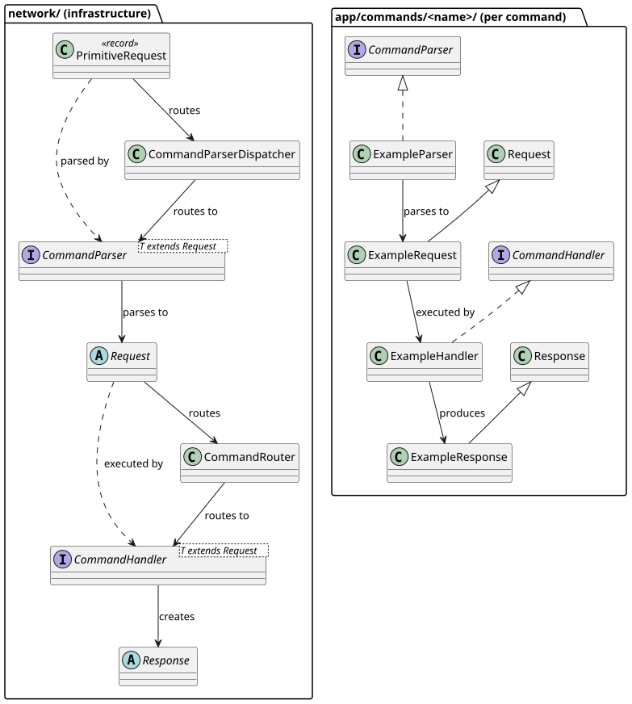

# Commands
Commands are the primary extension point of the server. 
Every client-facing operation e.g. checking a username, sending a chat message, joining a lobby is implemented as a command. 
Each command consists of four classes: a **Parser**, a **Request**, a **Handler**, and a **Response**.

The infrastructure for routing and dispatching commands lives in the `network/` layer and is intentionally kept generic.
The concrete implementations for each command live in `app/commands/` and are wired together at startup in `ServerApp`.

## Contents
### Guides
- [Implementing a Command](./guide-on-implementing-a-command.md) - 
  Step-by-step walkthrough for adding a new command to the server, including registration and common pitfalls.

### Reference
- [Command Infrastructure](./commands-deep-dive.md) -
  Technical deep-dive into the `CommandParser`, `CommandParserDispatcher`, `CommandHandler`, `CommandRouter`, `Request`, and the response hierarchy.

## Key Concepts
**Each command is self-contained.**
A command's Parser, Request, Handler, and Response all live in the same package under `app/commands/<name>/`.
This keeps related code co-located and makes it easy to reason about a single command without navigating across multiple directories.

**The `network/` layer knows nothing about specific commands.** 
`CommandParser` and `CommandHandler` are generic interfaces. The `CommandParserDispatcher` and `CommandRouter` operate on those interfaces.
Adding a new command **never** requires modifying infrastructure code.

**Registration happens at the composition root.** 
All commands are wired in `ServerApp` by calling `parserDispatcher.register(...)` and `commandRouter.register(...)`. 
This keeps the wiring explicit and compiler-checked.
