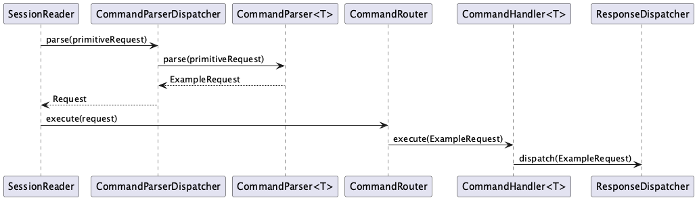
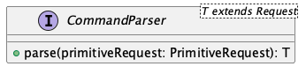
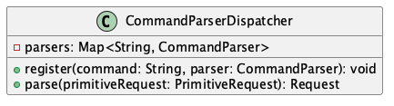
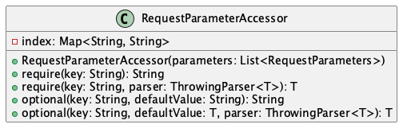
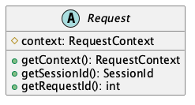
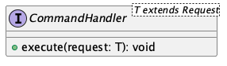
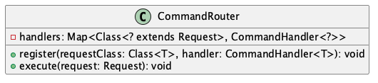
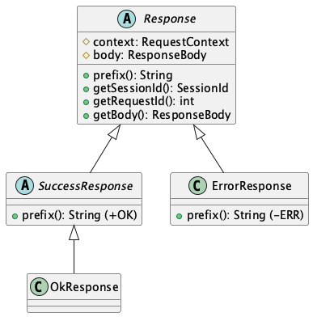

# Command Infrastructure
This document describes the generic command infrastructure that lives in the `network/` layer.
It covers the parsing pipeline, the routing pipeline, and the base types that every command builds on.

The infrastructure is intentionally project-agnostic: It has no knowledge of specific commands and is never modified when a new command is added.

## Overview
An incoming request travels through two sequential pipelines: **parsing** and **execution**.

The parsing pipeline converts a stringly-typed `PrimitiveRequest` into a strongly-typed `Request` subclass.
The execution pipeline routes that typed request to the correct handler, which produces a `Response`.



## Parsing Pipeline
### `CommandParser<T extends Request>`


The `CommandParser` is a single-method interface responsible for converting a `PrimitiveRequest` into a concrete, typed `Request` subclass. 
Implementations live in `app/commands/<name>/` and are registered by name in `CommandParserDispatcher`.

The parser is the correct place to validate and extract parameters. 
If a required parameter is absent, `RequestParameterAccessor.require(...)` throws an `MissingParameterException`, which the `SessionReader` catches and converts into a `MISSING_PARAMETER` error response for the client. 

Parsers **do not** perform any domain logic. Their only job is extraction and type conversion.

### `CommandParserDispatcher`


The `CommandParserDispatcher` holds a map from command name strings (e.g. `"PING"`) to their corresponding `CommandParser`.
When the `SessionReader` receives a `PrimitiveRequest`, it calls `dispatcher.parse(...)`, which looks up the parser by the request's command string and delegates parsing.

If no parser is registered for the command name, `parse(...)` throws an `UnknownCommandException`, which `SessionReader` catches and converts into an `UNKNOWN_COMMAND` error response for the client.

### `RequestParameterAccessor`


The `RequestParameterAccessor` is a helper provided to parsers for reading typed parameter values from a `PrimitiveRequest`. 
It indexes the parameter list by key on construction for O(1) lookups.

```java
// Require a parameter — throws MissingParameterException if absent
String username = accessor.require("USERNAME");

// Require and parse — throws ParameterParseException if conversion fails
int count = accessor.require("COUNT", Integer::parseInt);

// Optional with a default
String mode = accessor.optional("MODE", "default");
```

The `ThrowingParser<T>` functional interface accepted by the typed overloads allows any checked or unchecked exception to propagate from the conversion function. 
The `RequestParameterAccessor` wraps it in a `ParameterParseException`.

## Execution Pipeline
### `Request`


The `Request` is the abstract base class for all typed command requests. It carries a `RequestContext`, an immutable record containing the originating `SessionId` and the numeric `requestId`.
Both of which are later used by the handler to direct the response to the correct session.

Concrete subclasses add command-specific fields, all set via constructor. Requests are immutable value objects. They carry data, not behaviour.

### `CommandHandler<T extends Request>`


The `CommandHandler` is a single-method interface responsible for executing a typed request.
The handler contains the domain logic: reading from registries and managers, modifying state, and dispatching a response via the `ResponseDispatcher`.

Handlers receive their dependencies (the `ResponseDispatcher`, registries and managers etc.) through constructor injection. 
This keeps them fully testable without the network layer.

### `CommandRouter`


The `CommandRouter` maps `Request` subclasses to their handlers using the request's runtime class as the key.
The type safety of `register(...)` ensures that a handler can only be registered for the exact type it is parameterised on.
The unchecked cast in `execute(...)` is therefore safe by construction and is documented with a `@SuppressWarnings` comment in the source.

If no handler is registered for the given request type, `execute(...)` throws `UnknownRequestException`.
Unlike `UnknownCommandException` (which covers unknown command strings), this exception indicates a programming error i.e. a parser was registered without a corresponding handler.

## Response Types


The `Response` is the abstract base for all server responses. Its two concrete branches are `SuccessResponse` (prefix `+OK`) and `ErrorResponse` (prefix `-ERR`). 
Command-specific responses extend `SuccessResponse` and populate the body using the `ResponseBodyBuilder`.

`OkResponse` is a pre-built convenience subclass of `SuccessResponse` with an empty body, used for commands that need only acknowledge success without returning data (e.g. `PING`).

The body is built with a fluent `ResponseBodyBuilder`:

```java
// Simple key/value parameters
new ResponseBodyBuilder()
    .param("STATUS", UsernameAvailability.FREE)
    .build();

// Nested block
new ResponseBodyBuilder()
    .block("USER", b -> b
        .param("ID", user.getId().value())
        .param("NAME", user.getName()))
    .build();
```

`ResponseEncoder` serialises the body into the wire format (tab-indented, `END`-terminated blocks) and wraps it in a `PrimitiveResponse`.
`ResponseDispatcher` then enqueues this into the target session's bounded response queue.
